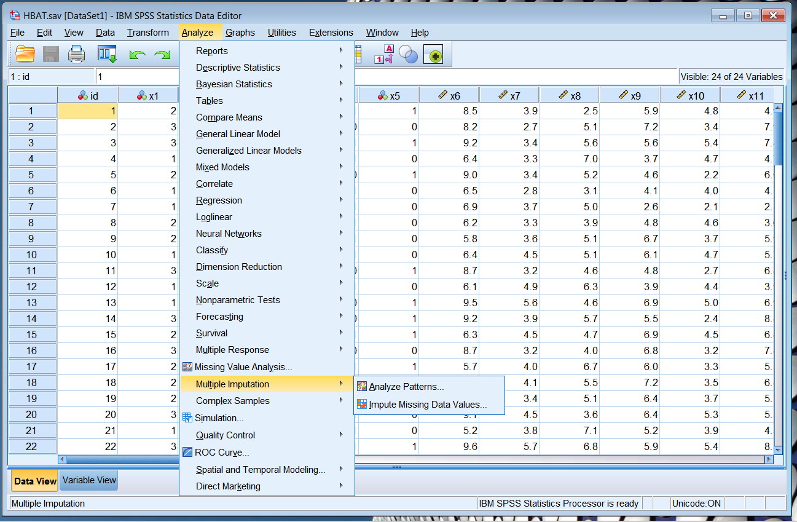
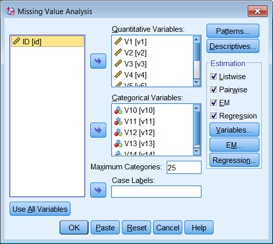
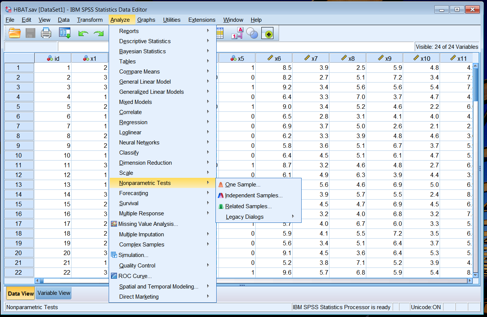

# COMM8002 Week 2

Lecturer: Gary Monroe

## Box and Whisker Plots

### Basic info

- One of the basic visual outputs from SPSS
- Simultaneous visualisation of central tendency and spread for multiple datasets (if placed side by side and with the same scale)
- Interval/ratio on the y-axis, categorical on the x-axis
- Outliers are defined as less than one quarter range from the box
- **Sidenote 1:** you can comment on dataset A being "significantly different" from dataset B if dataset A doesn't overlap with dataset B in terms of box: even if outliers (whiskers) overlap, the bulk of the datapoints don't overlap

### Generating in SPSS

1. Open your file (COMM8002 students: use  `HBAT`)
2. Analyze &rarr; Descriptive Statistics &rarr; Explore
3. Dependent list is the y-axis; factor list is the x-axis
4. Click on **plots** to make sure that box and whisker is generated

## Comparing means in SPSS

1. Compare Means &rarr; One-way ANOVA
2. Dependent list is the y-axis; factor list is the x-axis
3. **Post-Hoc** dialogue (shown in Figure 1 below) gives us various techniques; **options** (not shown in Figure 1 below) allows us to run the **homogenety of variance test**.
4. If _sig_ (p-value) is very low and therefore the means are significantly different then they don't really overlap per **sidenote 1**
5. Why do we use "magic numbers" like `0.05`? It's mostly tradition, because in the past we would only calculate only blocks

"If you know anything about statistics you might ask why we didn't just run a bunch of T-tests; it is because we will get a lot false positives by chance."

## Scatterplots

### Basic info

- Big cloud of data points &rarr; linear relationship, may even have a direction (e.g. positive), but probably a poor fit
- Curve &rarr; quadratic relationship, need to introduce a square term

### In SPSS

Graphs &rarr; Legacy &rarr; Scatter

## Data Quality

### Outliers

- Can be observed visually
- Can be observed by calculating number of standard deviations from the mean (z-score) - for **univariate outliers**
- Philosophical definition: the outlier is a point that is not representative of the population (so sometimes you have points that are very far away from others but **should be kept in**)
- Data entry error (should be kept out) vs. captured extraordinary event (probably should be kept in)
- D-square to calculate **multivariate outliers**

### Missing data

Notes:

- **Random?** &rarr; no worries, e.g. people forgetting a question here and there, probably okay to just exclude them or "impute" (guess what it would have been based on all other datapoints through mean or through regression) - imputing is questionable and you would at the very least acknowledge and disclose it. We call this `MCAR` (missing *completely* at random).
- **Systematic?** &rarr; run the means-comparison for all other variables to avoid distortion of results through selection bias. We call this `MAR` (missing at random) ("this is weird terminology ... not my terminology").
- Generally we set a threshold at 10% for allowance for missing data.

In SPSS:

COMM8002 students: use `HBAT_MISSING.sav` which actually has missing data.

In the dialog:

Okay ... let's try to figure out what the **Estimation** section means `(o_0);;`:

- **Listwise:** if we were to later exclude cases listwise in a regression (Regression &rarr; Linear Model), we would drop all cases with any kind of missing data.
- **Pairwise:** so this one is doing the *imputing* - note that it could increase the likelihood of getting significant results, and it becomes sensitive to the other variables because the other variables are the ones helping with the regression &rarr; so more variables is better.

## Classic philosophical assumptions

### Normality

i.e., bell curve distribution.

How to test?

- Test kurtosis and skewness (analyze &rarr; descriptive statistics &rarr; descriptives &rarr; options)
- Visually do a normal probability plot (analyze &rarr; descriptive statistics &rarr; p-plot)
- Use the techniques in analyze &rarr; nonparametric tests &rarr; **one sample**. It will auto-magically pick the right tests to check for normality and give you the outcomes as accept/reject.

### Others 

- Linearity (as opposed to curvy correlation line)
- Homoscedasticity (the regression line is constant)
- Non-correlated errors (no bias)