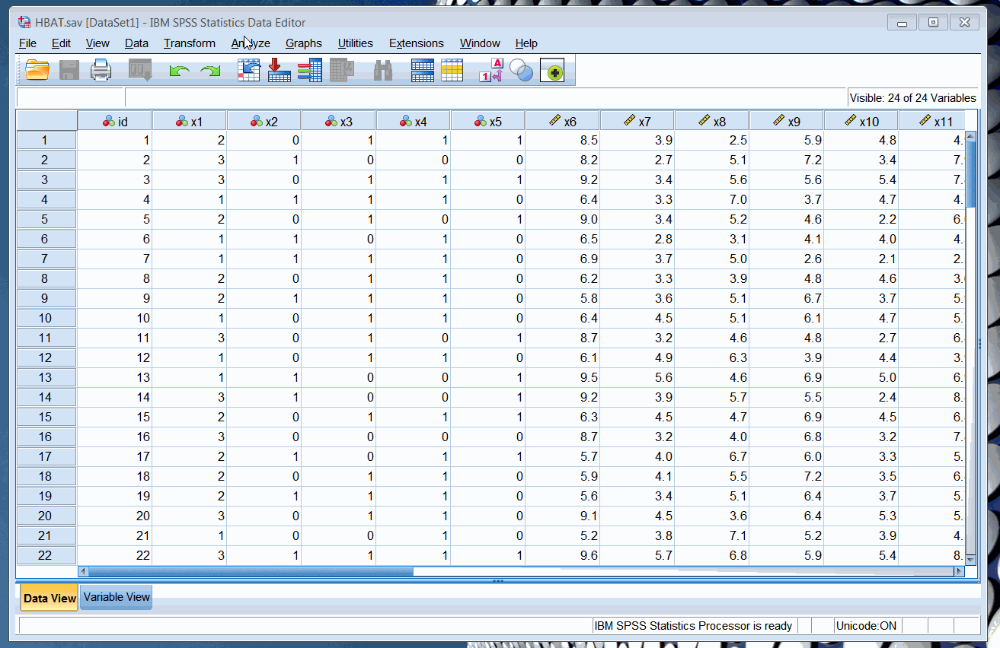
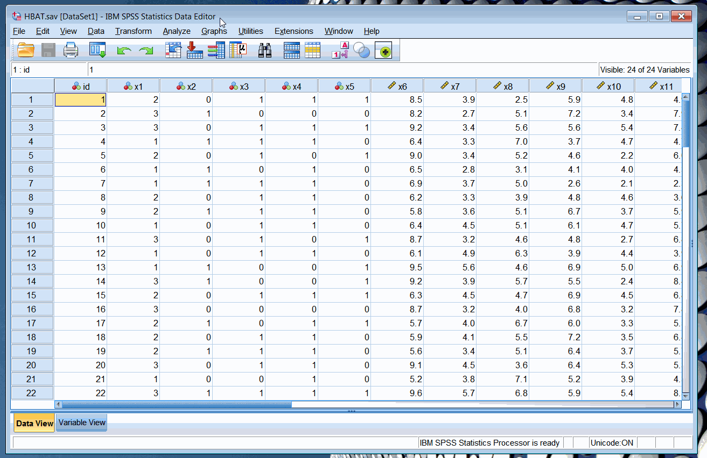

## COMM8002 Week 2

Lecturer: Gary Monroe.

## Box and Whisker Plots

### Basic info

- One of the basic visual outputs from SPSS
- Simultaneous visualisation of central tendency and spread for multiple datasets (if placed side by side and with the same scale)
- Interval/ratio on the y-axis, categorical on the x-axis
- Outliers are defined as less than one quarter range from the box
- **Sidenote 1:** you can comment on dataset A being "significantly different" from dataset B if dataset A doesn't overlap with dataset B in terms of box: even if outliers (whiskers) overlap, the bulk of the datapoints don't overlap

### Generating in SPSS

1. Open HBAT file
2. Analyze &rarr; Descriptive Statistics &rarr; Explore
3. Dependent list is the y-axis; factor list is the x-axis
4. Click on **plots** to make sure that box and whisker is generated

## Comparing means in SPSS

1. Compare Means &rarr; One-way ANOVA
2. Dependent list is the y-axis; factor list is the x-axis
3. **Post-Hoc** dialogue (shown in Figure 1 below) gives us various techniques; **options** (not shown in Figure 1 below) allows us to run the **homogenety of variance test**.
4. If _sig_ (p-value) is very low and therefore the means are significantly different then they don't really overlap per **sidenote 1**
5. Why do we use "magic numbers" like `0.05`? It's mostly tradition, because in the past we would only calculate only blocks

"If you know anything about statistics you might ask why we didn't just run a bunch of T-tests; it is because we will get a lot false positives by chance."

## Scatterplots

### Basic info

- Big cloud of data points &rarr; linear relationship, may even have a direction (e.g. positive), but probably a poor fit
- Curve --> quadratic relationship, need to introduce a square term

### In SPSS

Graphs &rarr; Legacy &rarr; Scatter

## Outliers

- Can be observed visually
- Can be observed by calculating number of standard deviations from the mean (z-score)